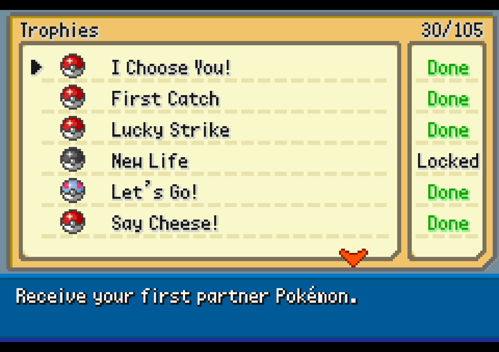

## Trophies
{small}
There are over 100 trophies to obtain in Soulgold, and you are rewarded for reaching certain
milestones when obtaining enough of them.

Speak to the gentleman in Route 40 house to collect rewards and to check your current progress towards the next milestone.

{small}

## The rewards

### 15 trophies

- **Reward** Shiny Patch
    - This consumable turns any Pokémon you own into a shiny version!

### 30 achievements

- **Reward:** Ash-Greninja
    - This Pokémon has a special ability **Battle Bond** which allows it to transform after KOing an opponent.
{small}

### 45 achievements

- **Reward:** Poipole
    - Ultra Beast that starts off weak, but turns into a powerful Pokémon after learning Dragon Pulse.

### 60 achievements
- **Reward:** Eternal Floette
    - A special Floette capable of Mega Evolution and boasting much higher stats than your average Floette. 

### 75 achievements
- **Reward:** Zarude
    - A mythical Pokémon from the jungle. 

### 100 achievements
- **Reward:** Original Color Magerna
    - This version of Magerna is usually given for completing the Pokédex, however this time it can be obtained by completing 100 achievemnts. Quite a feat! 

> Note: All the Pokémon given by the gentleman can be shiny, and they will show as one in the preview picture if they are shiny.