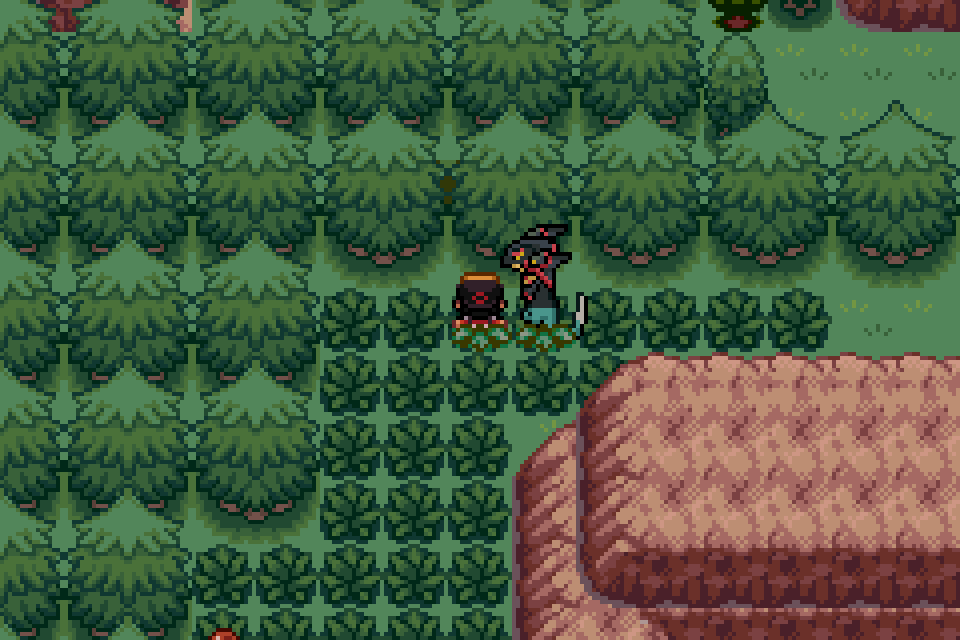
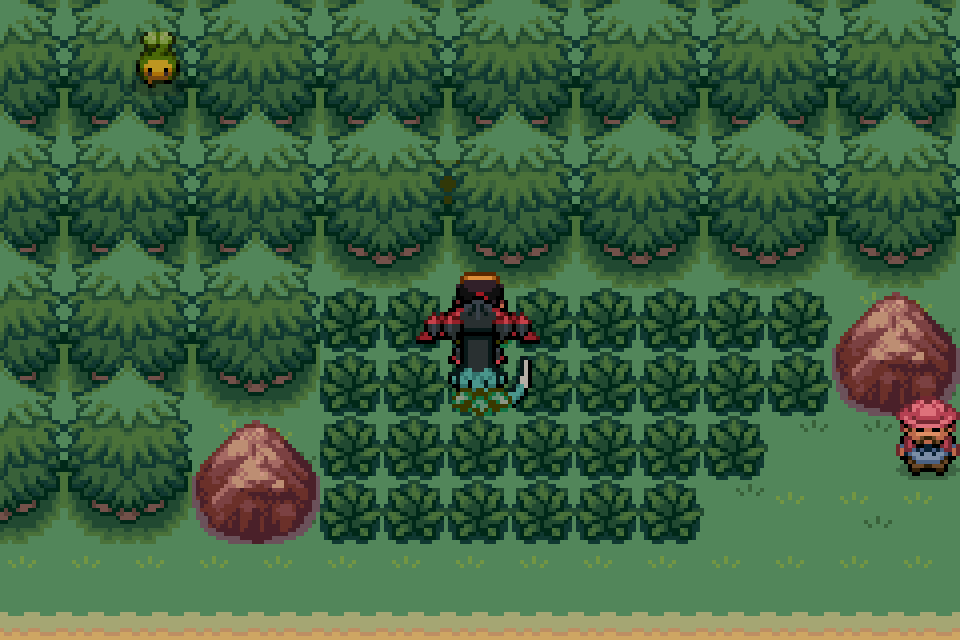
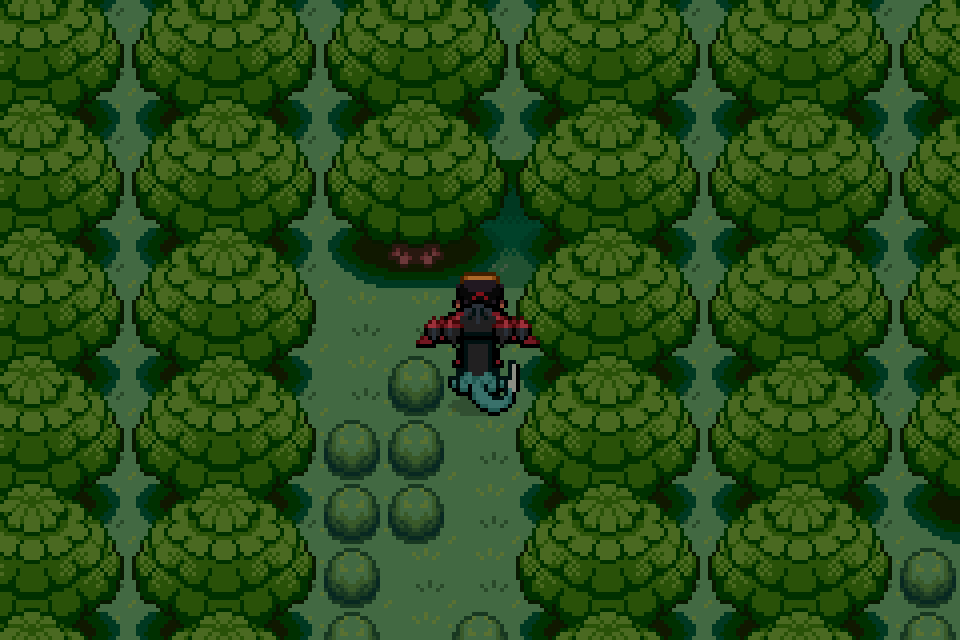
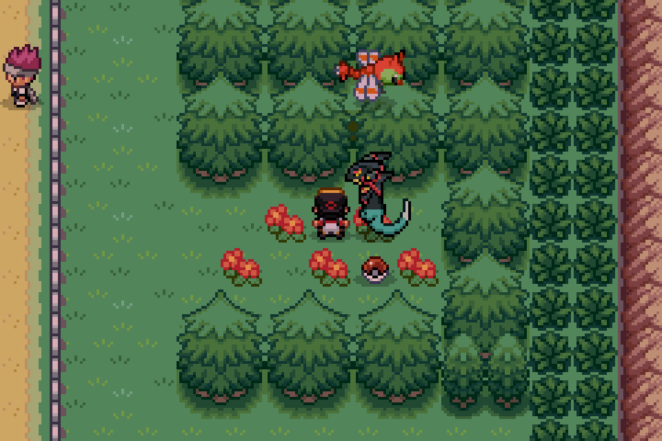
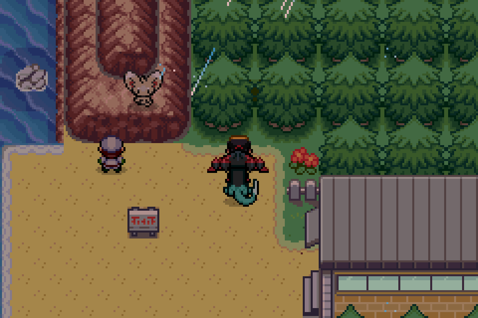
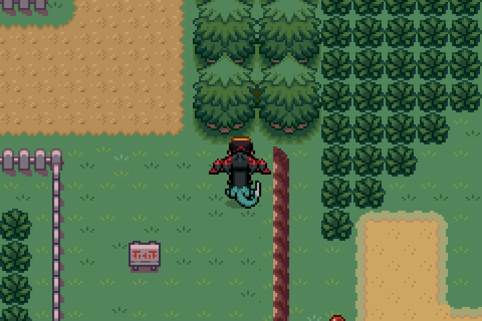
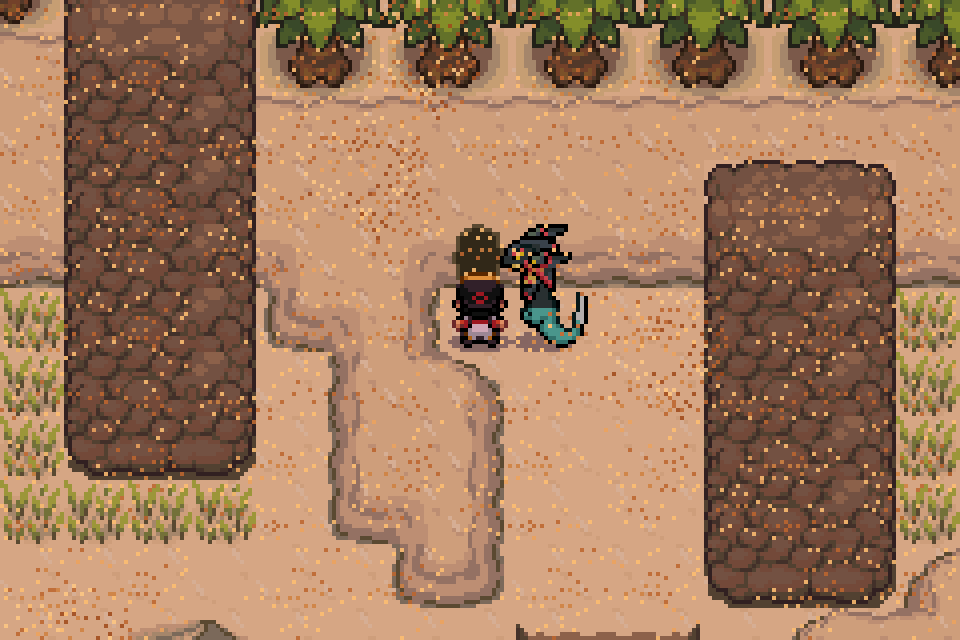
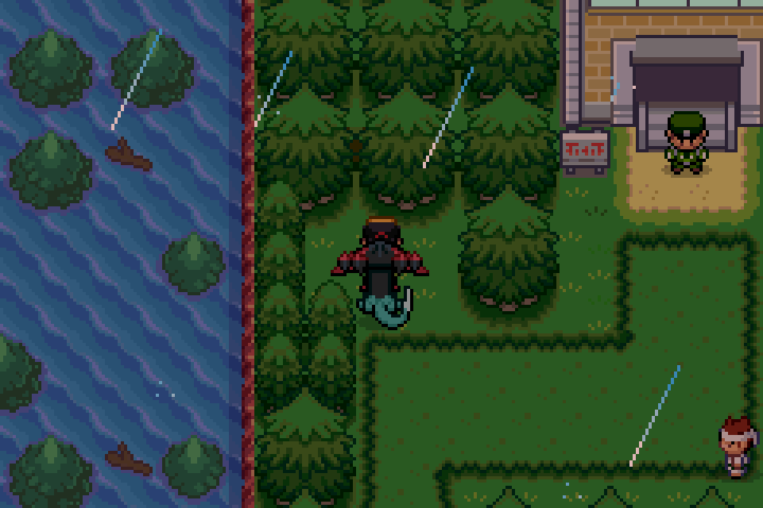
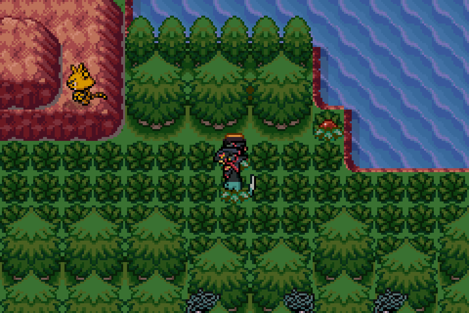
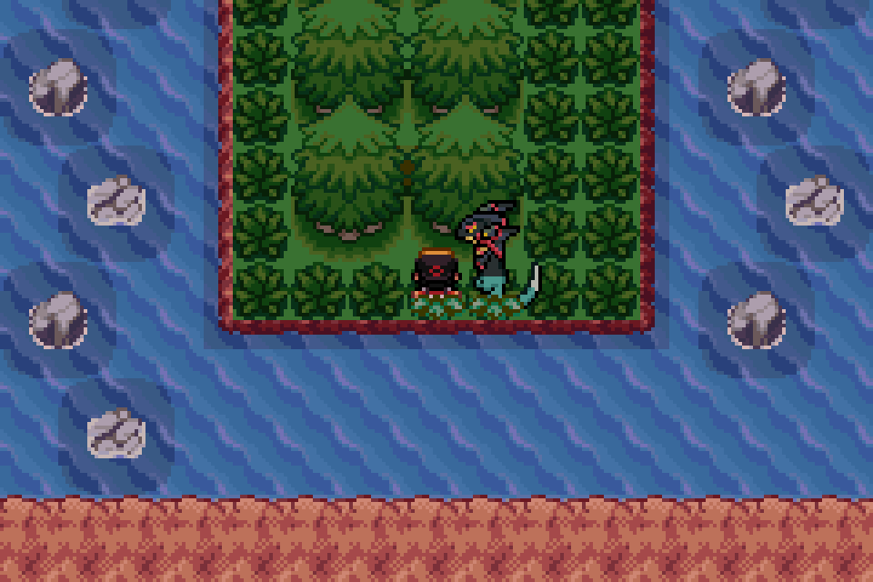

### How Hidden Grottos work

- Interact with suspicious paths behind trees to enter a Grotto.
- Grottos repopulate once per day. A Beckoning Bell can also refresh them (One is obtained for free in Ilex Forest from an npc, more can be farmed from Battle Factory after beating the third gym).
- A Hidden Grotto has a 60% chance to contain a Pokémon, a 32% chance to be a generic item such as Rare Candy, PP Up and such, and a 8% chance to contain a grotto specific item.
- Grotto Pokémon have two guaranteed 31 IVs and their Hidden Ability. Each of the four Pokémon in a grotto is equally likely to spawn when the grotto rolls a Pokémon spawn.
- The Grotto specific item listed below is one possible result and is not guaranteed.

### Locations

- **Route 32 (Lv. 10):** Applin, Paldean Wooper, Mareep, or Misdreavus. Grotto specific item: Everstone.

{small}

- **Route 33 (Lv. 14):** Pachirisu, Mienfoo, Darumaka, or Cottonee. Grotto specific item: Sun Stone.

{small}

- **Ilex Forest (Lv. 15):** Oddish, Ferroseed, Roselia, or Exeggcute. Grotto specific item: Leaf Stone.

{small}

- **Route 35 (Lv. 18):** Rookidee, Pikachu, Poltchageist, or Eevee. Grotto specific item: Unremarkable Teacup.

{small}

- **Goldenrod Shore (Lv. 20):** Minccino, Shroomish, Own Tempo Rockruff, or Heracross. Grotto specific item: Light Clay.

{small}

- **Route 38 (Lv. 30):** Munchlax, Male Meowstic, Female Meowstic, or Espathra. Grotto specific item: Stardust.

{small}

- **Vajra Desert (Lv. 30):** Baltoy, Vullaby, Larvitar, or Gible. Grotto specific item: Smooth Rock.

{small}

- **Lake of Rage (Lv. 35):** Cyclizar, Maushold, Falinks, or Drampa. Grotto specific item: Eviolite.

{small}

- **Route 44 (Lv. 40):** Arctibax, Bergmite, Lopunny, or Hisuian Zorua. Grotto specific item: Ice Stone.

{small}

- **Route 47 (Lv. 40):** Chansey, Larvesta, Ditto, or Zorua. Grotto specific item: Lucky Egg.

{small}
